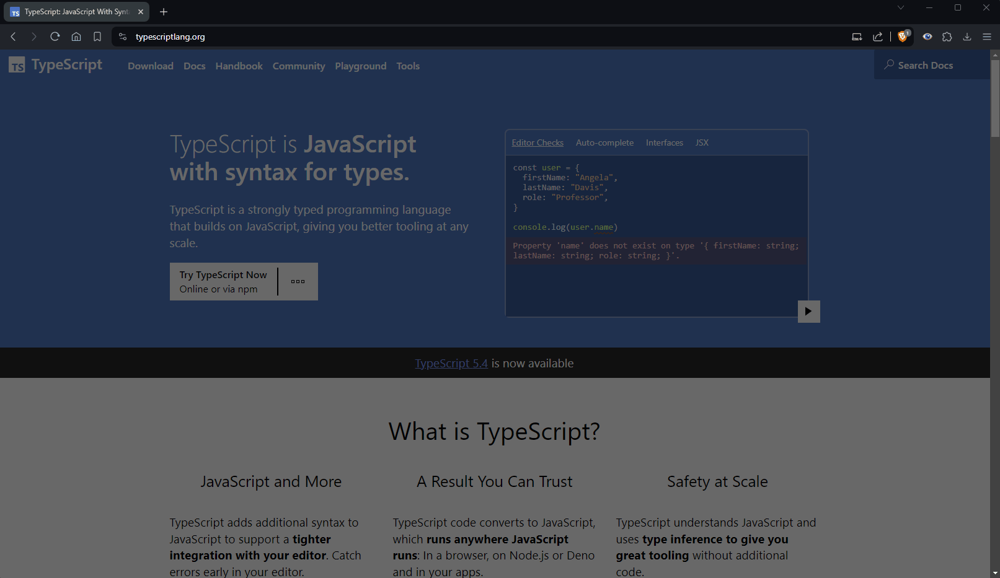

***

***

Created with [chrome-extension-boilerplate-react-vite](https://github.com/Jonghakseo/chrome-extension-boilerplate-react-vite) template. 

**Don't Burn My Eyes** is a simple extension that allows you to darken web pages that are too bright. You can control the extension from the pop-up menu or from the options page for more advanced configuration.

***

## Features
### Operation modes
**Don't Burn My Eyes** can operate in three modes: **blacklist**, **whitelist** or **always on**.

In **blacklist mode**, **Don't Burn My Eyes** will not work on the websites you have selected.  
In **whitelist mode**, **Don't Burn My Eyes** will only work on the websites you have selected.  
In **always on** mode, **Don't Burn My Eyes** will work on all websites.

### Adding sub-urls
With this feature, you can add sub-urls to a blacklist or whitelist. Useful when the color scheme of a sub-page differs from the rest of the website.

### Exporting/Importing urls
You can export saved pages to a JSON file or import from a JSON file. Importing does not overwrite the saved pages, instead it only adds the pages you did not save earlier.

***
## Translation
**Don't Burn My Eyes** automatically adapts the language to the browser language. The following languages are currently available:

- English (Default)
- Polish

If you want to translate **Don't Burn My Eyes** into your language, download the [messages.json](https://github.com/pabblo097/dont-burn-my-eyes/blob/main/public/_locales/en/messages.json) file, translate the 'message' fields and send it back to me. I will take care of the rest.

***

## Donation
If you would like to make a donation, you can do so [here](https://www.paypal.com/paypalme/pabblo097).